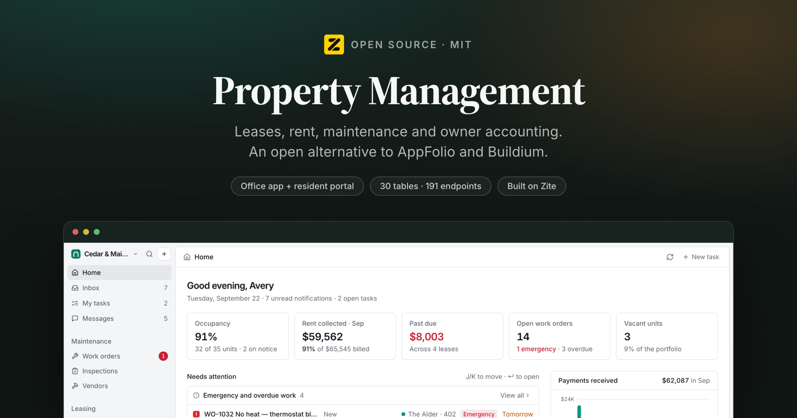
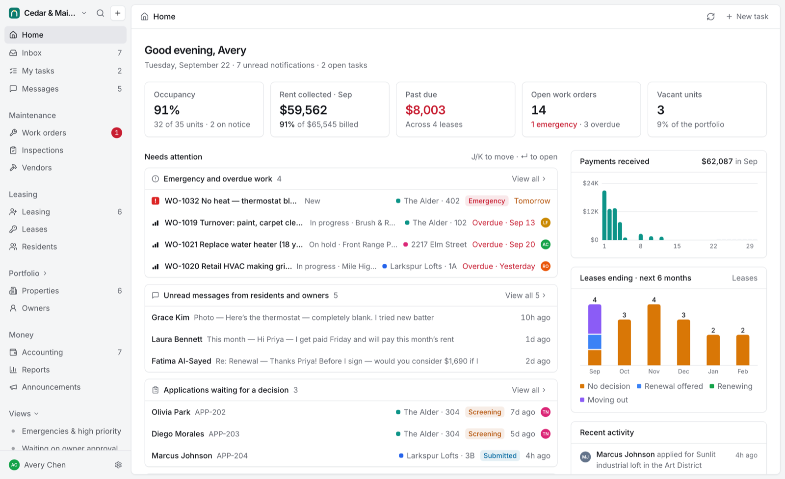
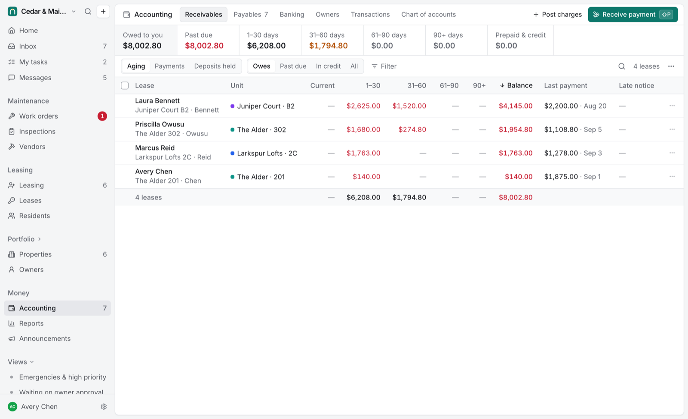

<p align="center">
  
</p>

<h3 align="center">Property Management</h3>

<p align="center">
  Open-source property management: leases, rent, maintenance and owner accounting.
  <br/>
  An open alternative to <b>AppFolio</b>, <b>Buildium</b> and <b>DoorLoop</b>.
</p>

<p align="center">
  <a href="#whats-in-it">Features</a> ·
  <a href="#install-it-in-your-own-workspace">Install</a> ·
  <a href="#how-it-works">How it works</a> ·
  <a href="#local-development">Development</a> ·
  <a href="BRIEF.md">Build brief</a>
</p>

<p align="center">
  <a href="LICENSE"></a>
  <a href="https://github.com/zite/property-management/stargazers"></a>
  <a href="https://www.npmjs.com/package/zitejs"></a>
</p>

---

## What this is

Property management for residential portfolios: leasing, residents, maintenance,
trust-style accounting, owner reporting, and a portal for everyone outside the
office.

This is a **Zite solution**, meaning a workspace you install into your own
[Zite](https://zite.com) account and then edit. Zite provides the Postgres
database, the endpoint runtime, auth and hosting. Everything above that is the
~97,000 lines of TypeScript in this repository.

Two apps share one database:

| App | Directory | Who uses it | Access |
| --- | --- | --- | --- |
| **Property Management** | `apps/property-management` | The office: admins, property managers, leasing agents, maintenance, accountants | Internal (organization members) |
| **Resident Portal** | `apps/resident-portal` | Residents, applicants, owners and vendors, one sign-in whichever roles their email has | External (public, with sign-in) |

It opens on a populated demo: Cedar & Main Property Management, with 6 properties,
35 units and 8 months of books, so every screen has something in it the first time
you look. The person who installs it is linked in as a resident, an owner and a
vendor contact so each portal area has something to show. Settings has a one-click
way to delete all of it.

<p align="center">
  
</p>

---

## What's in it

### For the office (Property Management)

- **Home.** A role-aware morning view: occupancy, rent collected against billed, past due,
  open work and vacancies; a "needs attention" list (emergencies and overdue work,
  applications waiting, leases ending without a renewal decision, move-ins and move-outs,
  delinquent leases, bills due, owner approvals, unread messages); collections by day,
  expirations by month and recent activity.
- **Inbox and tasks.** Notifications with read, archive and snooze. Tasks with due dates,
  priorities, assignees and links to any record; the daily automation opens renewal,
  move-out and insurance tasks on its own.
- **Work orders.** A keyboard-first list, board and table (J/K, X to select, Space to peek,
  S/P/A/V/D to change a property) with filters, grouping, bulk edits, saved views and CSV.
  Detail pages carry photos, entry permission, the resident and vendor conversation,
  internal notes with @mentions, owner approval for estimates over a limit, the vendor's
  bill and chargebacks to the resident. AI suggests a title, category and priority from a
  description when enabled; keyword rules do it otherwise.
- **Vendors, inspections and recurring maintenance.** Vendor compliance (insurance
  certificates, W-9, 1099 prep), spend and portal access. Inspections built for a phone
  walkthrough: condition per item, notes, photos, work orders from flagged items, a
  move-out comparison against the move-in and a PDF report shared with the resident.
  Preventive maintenance schedules generate work orders ahead of their due dates.
- **Leasing.** Applications through screening (identity, income, employment, rental
  history, credit, background) to an approve or deny decision with neutral, compliant
  emails; leads with replies, showings and application links; listings with photos,
  AI-written descriptions and a public page; a vacancies view of what needs renting.
- **Leases and residents.** New leases from a unit or an approved application, e-signature
  or a recorded paper signature, activation that posts the deposit and prorated first
  month, recurring charges (rent, pet rent, parking, utilities), renewals that extend the
  same lease at the new rent from the right month, notice, move-out checklists and a
  deposit settlement that posts deductions, applies the deposit, refunds the rest and
  sends the resident a statement.
- **Accounting.** Double-entry books kept per property. Receivables aging, payments,
  charges, credits, late notices and bulk bill-backs; payables with bills split across
  properties and one payment per vendor; bank registers, transfers, expenses and
  reconciliation; owner contributions, distribution runs and management fee runs; every
  transaction with its journal lines; journal entries and the chart of accounts. Voids
  never delete, the entry stays on the record with who and why.
- **Portfolio.** Properties with occupancy, rent, cash, deposits and what's available to
  distribute; units with readiness and market rent; owners with cash-basis statements,
  transactions, documents and messages.
- **Messages and announcements.** One conversation per resident, owner, vendor, applicant
  and work order, shared with the portal; templates with merge tags; announcements to
  properties, units, owners or vendors, sent now or scheduled, with delivery tracking.
- **Reports.** Rent roll, delinquency and aging, income statement (cash or accrual, by
  month or property), balance sheet, cash flow, trial balance, general ledger, owner
  statement, deposits held, payments, vacancy, lease expirations, leasing funnel, work
  orders, vendor spend and 1099, occupancy, each with shareable parameters, CSV, print
  and PDF.
- **Settings.** Organization and brand, rent and late-fee policy (with a worked example),
  leasing policy and the lease template, maintenance and owner approval limits, portal
  text, team and roles, email templates with test sends, the daily automation (and run
  now), integrations, and removing the demo data.
- **Everywhere:** ⌘K command menu and search, `C` for a new work order, `⇧P` to receive a
  payment, G-then-letter navigation, `?` for every shortcut, optimistic edits, light and
  dark themes, and layouts that work on a phone.

### For everyone else (Resident Portal)

- **Applicants** browse homes for rent, send an inquiry, apply in steps with autosave,
  pay the application fee (when Stripe is connected), follow their application and message
  the office.
- **Residents** see what they owe and why, pay online or read the office's payment
  instructions, request maintenance with photos and follow it to completion, sign their
  lease, accept a renewal, give notice, review inspection reports, read building news and
  keep documents and messages in one place.
- **Owners** see each property's occupancy, rent roll, cash flow and maintenance, read
  monthly or year-to-date statements (PDF), approve or decline estimates over the
  approval limit, and message their manager.
- **Vendors** get their assigned work with access details, schedule and complete jobs,
  message the office, submit invoices and follow their bills and payments.

---

## Install it in your own workspace

Zite apps are built by pointing a coding agent at the platform over MCP, and
installing one works the same way.

**1. Connect the Zite MCP server to your agent.**

```bash
claude mcp add --transport http zite https://mcp.zite.com/mcp
```

(Cursor, VS Code and any other MCP client work the same way. See
[the Zite quickstart](https://developers.zite.com/quickstart).)

**2. Give it this prompt.**

> Install https://github.com/zite/property-management into a new Zite workspace.
>
> 1. `create_workspace` named "Property Management", then `create_sandbox` on it.
> 2. In the sandbox, add this repo as a git remote and check its files out over
>    `/workspace`, keeping the sandbox's own `zite.config.json`.
> 3. Read `zite.schema.json` and create all 30 tables with `create_table`, passing
>    each field's `definition` (`name`, `type`, `template`) straight through. Do this
>    **before** `create_app`, because `create_app` and `check_app` refresh
>    `zite.schema.json` from the live database, and would otherwise blank it.
> 4. `create_app` "Property Management" (internal) and "Resident Portal" (external).
>    Use those names exactly: the directory is derived from the name, and these two
>    produce `apps/property-management` and `apps/resident-portal`, which is what
>    this repo already uses.
> 5. Run `yarn install`, so the workspace packages are linked and `@project/shared`
>    resolves.
> 6. `check_app` both apps, `commit`, then `publish_app` both.

**3. Open the office app.** It seeds the demo on first load, which takes a couple of
minutes because it posts eight months of books. When you are ready for real data,
use **Settings → Data → Remove demo data**.

<p align="center">
  
</p>

---

## How it works

A Zite workspace is **one database with one or more apps on top of it**. The split
that matters:

| Part | Where it runs |
| --- | --- |
| `apps/*/src/` minus `api/` | The browser. A normal Vite + React SPA. |
| `apps/*/src/api/*.ts` | Zite's endpoint runtime, server-side. One file = one endpoint. |
| `packages/*` | Imported by both. No build step; consumed as TypeScript source. |
| `.zite/` | Generated clients: typed DB access and a typed caller. Never edited by hand. |

The frontend never touches the database. It calls endpoints through a generated
typed client (`import { getDashboard } from 'zitejs/api'`), and endpoints reach the
database through another (`import { zite } from 'zitejs/db'`). 191 endpoints: 134
in the office app and 57 serving the portal.

**[BRIEF.md](BRIEF.md)** covers how the code is organised, the platform's runtime
rules and the ledger engine. Read it before changing anything that touches money.

## Roles

| | Admin | Property Manager | Leasing Agent | Maintenance | Accountant |
| --- | :-: | :-: | :-: | :-: | :-: |
| Properties and units | ✓ | ✓ | view | view | view |
| Owners and statements | ✓ | ✓ | | | ✓ |
| Leasing, leases and residents | ✓ | ✓ | ✓ | | |
| Work orders, inspections, schedules | ✓ | ✓ | create | ✓ | |
| Vendors | ✓ | ✓ | | ✓ | ✓ |
| Receivables (payments, charges) | ✓ | ✓ | view | | ✓ |
| Payables | ✓ | ✓ | | | ✓ |
| Banking and reconciliation | ✓ | | | | ✓ |
| Reports | ✓ | ✓ | | | ✓ |
| Messages | ✓ | ✓ | ✓ | ✓ | ✓ |
| Announcements | ✓ | ✓ | | | |
| Settings and team | ✓ | | | | |

The matrix lives in `packages/shared/roles.ts` and is enforced by every endpoint; the UI
hides what a role can't do. Settings → Roles & permissions shows the full list.

---

## The data model

30 tables. Money is double-entry: nothing stores a balance.

```
Owners ──< Properties ──< Units ──< Leases >──< LeaseTenants >── Tenants
                │            │         ├──< RecurringCharges
                │            │         └──< Transactions ──< JournalLines >── Accounts
                │            │                   └──< Allocations (payment → charge, bill payment → bill)
                │            ├──< WorkOrders >── Vendors        ├──< Inspections
                │            └──< Listings ──< Inquiries        └──< Applications
                └──< MaintenanceSchedules · Reconciliations · Documents
Messages · Announcements · EmailTemplates · Tasks · Notifications · Activity · Views
Members · Settings · OnlinePayments
```

### Decisions worth knowing before extending it

**Every amount comes from the journal.** `packages/shared/server/ledger.ts` is the only
code that writes `Transactions`, `JournalLines` and `Allocations`. Each entry type
(charge, payment, credit, refund, deposit application, bill, bill payment, expense, owner
contribution and distribution, management fee, transfer, journal entry) has one function
that validates and posts balanced lines tagged with the property, unit, lease and vendor.
Lease balances, deposits held, bank balances, owner statements and every report are
aggregates over those lines, so they can't disagree. Payments apply oldest-first unless
told otherwise; a voided charge frees its payment to the next open charge.

**Books are kept per property.** Cash, receivables, payables and deposits carry a property
on every line, so a bill split across buildings is paid from each building's cash and an
owner statement reconciles to the bank lines for exactly their properties
(`server/ownerStatement.ts` reports any difference rather than hiding it).

**A renewal extends the same lease.** New end date, and a new rent recurring charge that
starts the first month not yet billed. The resident's ledger, deposit and history stay
continuous. Lease phase (Upcoming, Current, Expiring, Notice, Month-to-month…) and unit
occupancy are derived from dates in `packages/shared/leases.ts`, never stored.

**Both apps share `packages/shared`.** Money, dates, merge tags, templates, roles, lease
rules and all server helpers (who's asking, the ledger, statements, email, automation) are
imported by the staff app and the portal alike. Don't import `zod` there: the root
`node_modules` has zod 4 while endpoints use each app's zod 3.

**Identity comes from the session.** Staff endpoints resolve `getActor(context)` and check
a capability; portal endpoints resolve the verified email to a resident's leases, an
owner, a vendor or an applicant's applications, and scope every query to that. "Missing"
and "not yours" are the same not-found. Zite doesn't enforce an endpoint's `inputSchema`,
so every endpoint re-parses its input.

**Foreign keys are text columns.** Joins cast the uuid side (`p.id::text = w."propertyId"`)
and unset text is `''`, never `NULL` (`ref()` in `server/sql.ts` normalises it).

**Writes are sequential.** Zite rate-limits bursts of parallel database writes, so bulk
operations (seeding, bulk charges, announcements, demo removal) write one at a time or in
`bulkCreate` batches of 100, and long jobs resume across calls under the 150-second
endpoint limit.

---

## Local development

```bash
yarn install
cp .env.example .env.local   # then put your own workspace id in it
yarn dev                     # office app on :8080
yarn dev:resident-portal     # portal on :8081
```

**What works offline:** the whole frontend, `tsc`, and `vite build`. Editing a
component hot-reloads.

**What does not:** the endpoints in `src/api/` execute on Zite's runtime against
your workspace database, not on your machine. `yarn dev` serves the UI, but every
endpoint call goes out to the workspace named in `.env.local` and needs a session
for that organization. There is no local database mode yet.

Run `yarn generate` after adding, renaming or deleting an endpoint.

```bash
yarn run check   # tsc + endpoint bundling + vite build, both apps
```

> **Note.** On apps this size `zitejs check` prints `bundle endpoints ✗` with no
> error and exits non-zero. That is a 1 MB stdout buffer in the checker, not a real
> failure. To see genuine endpoint errors, bundle to a file instead:
> `npx zitejs bundle --app property-management > /tmp/b.json` and read
> `endpointErrors`.

---

## Tech stack

React 18 · TypeScript · Vite · Tailwind CSS 3 · [shadcn/ui](https://ui.shadcn.com) ·
Radix · TanStack Query & Table · Recharts · dnd-kit · date-fns · zod ·
[zitejs](https://github.com/zite/zitejs) (database, endpoints, auth, email, PDF,
uploads, schedules) · [Claude](https://www.anthropic.com) for the optional AI features.

## Contributing

Issues and pull requests are welcome. See [CONTRIBUTING.md](CONTRIBUTING.md), and
read [BRIEF.md](BRIEF.md) before changing anything in the ledger. Anything
security-related goes to [SECURITY.md](SECURITY.md) instead of a public issue.

## License

MIT. See [LICENSE](LICENSE). Third-party notices in [NOTICE](NOTICE).
